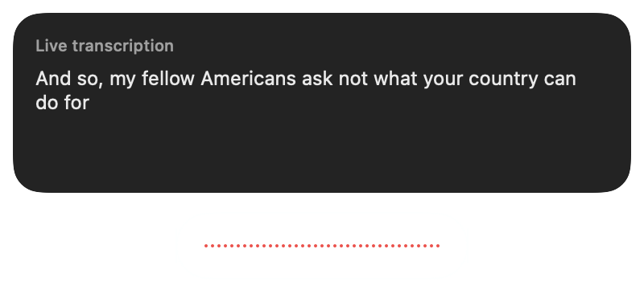

# Live transcription with Parakeet Unified

Choose **Parakeet Unified 0.6B** in Petal's model picker and download its model.
Recording with the shortcut, capsule or `petal://start` then shows English text
above the floating capsule as you speak. Stop normally to finalize and paste.
Live text is a preview; Petal pastes once, after the decoder flushes its remaining
audio and any requested Apple Intelligence refinement completes.



The model runs locally through FluidAudio and CoreML. Petal downloads one INT8
encoder with 640 ms of chunk and look-ahead context, plus the shared decoder and
vocabulary (approximately 625 MB total). This context duration is not a promise
of end-to-end latency. Loading and inference add to it. Handy's GGUF model file
cannot be reused by the CoreML runtime.

Existing models and the recommended default are unchanged. Unified also works
with dropped files and history reprocessing through the same streaming decoder.

## Recording lifecycle

- Capture writes the normal history audio file and delivers owned 16 kHz mono
  PCM chunks in order. Both the system default and selected input devices use
  `AVCaptureAudioDataOutput` for streaming.
- An ordered consumer decodes during capture and publishes complete transcript
  snapshots. A 30-second queue bounds memory while a model loads. Queue overflow
  fails the stream rather than silently dropping speech.
- Stop drains the capture queue, emits the last partial audio chunk, closes the
  stream and waits for the decoder's final flush before refinement, history and
  paste. Live capture uses the original audio; file trimming and speed-up are
  not applied during streaming.
- Cancellation stops capture and awaits the inference task before another
  recording can start. Session identity prevents late text from reaching a new
  recording. The model chosen at recording start is retained for that session.
- If streaming fails, Petal awaits decoder cleanup and transcribes the saved
  recording. Partial text is never used as a fallback final result.
- A completed file inventory distinguishes a downloaded model from directories
  left by a paused or interrupted download.

## Dependency

Petal uses the upstream [FluidInference/FluidAudio](https://github.com/FluidInference/FluidAudio)
release, which includes Parakeet Unified. Upstream removed its Qwen3 ASR backend,
so PetalKit keeps those sources in the `Qwen3ASR` target under the Apache 2.0 license.

## Validation

The regular PetalKit suite covers PCM order and tail delivery, bounded-buffer
failure, cancellation, real speech resampling, model mapping, download receipts
and streaming bypass of file preprocessing. FluidAudio separately tests
windowing for all four model contexts and real CoreML reset/cancellation behavior.

An opt-in PetalKit integration test runs the real audio capture client in its
existing fixture mode, the real CoreML engine, and the floating transcript panel:

```sh
PETAL_TEST_UNIFIED_STREAMING=1 \
PETAL_E2E_AUDIO_FILE=/path/to/whisper.cpp/samples/jfk.wav \
swift test --package-path PetalKit \
  --filter realUnifiedStreamsThroughCaptureAndFlushesBeforeReturning
```

It downloads missing model artifacts through Petal's normal downloader and needs
`aria2c` available. It checks that partial text arrives before stop and awaits the
final transcript. It does not use the microphone, paste text or write history.
Set `PETAL_STREAMING_SCREENSHOT_PATH` to an output PNG path to capture the actual
panel during the test.

Before release, verify the shortcut's hold/toggle behavior and recording through
built-in, USB and Bluetooth microphones, including a very short recording,
cancel/restart, silence, model changes, and disconnecting a selected device.
